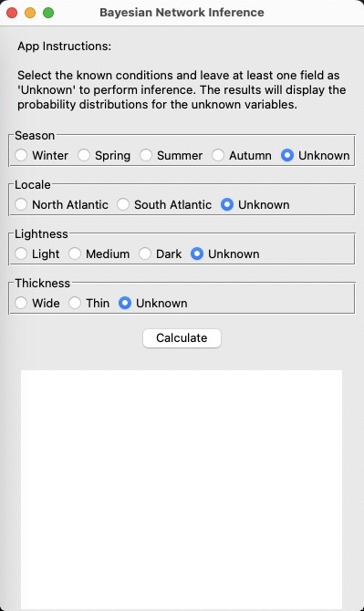
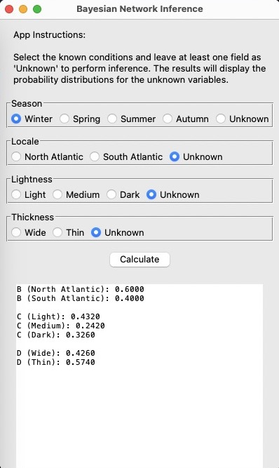
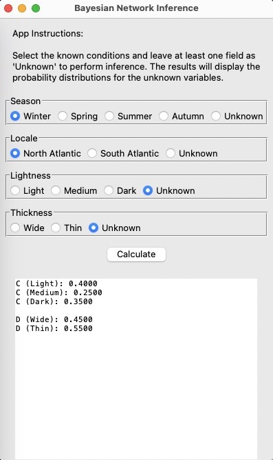
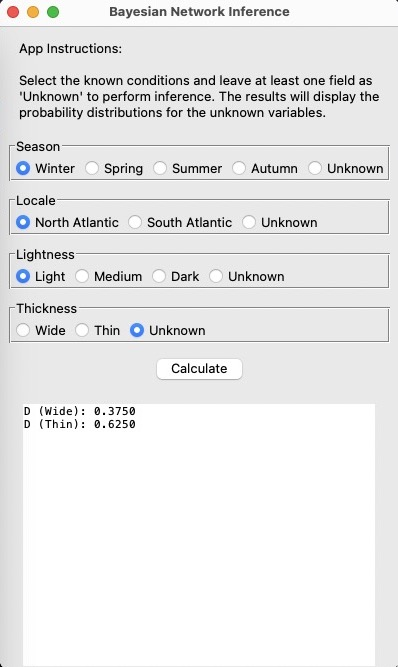

# EECE 7219: Pattern Recognition
## Final Software Assignment: Bayesian Inference
### Kevin McKenzie
##### 4/25/2024


## Setup
- open terminal and move to desired folder location
- clone git repo
```zsh
git clone git@github.com:kevmck451/bayes_app.git
```
- change directory into bayes_app folder
```zsh
cd bayes_app/
```
- create virtual environment
```zsh
python3 -m venv --system-site-packages venv
```
- activate environment
```zsh
source venv/bin/activate
```
- install necessary libraries
```zsh
pip install -r requirements.txt
```


## Run App
- run app as a package
```zsh
python3 -m app.main
```







